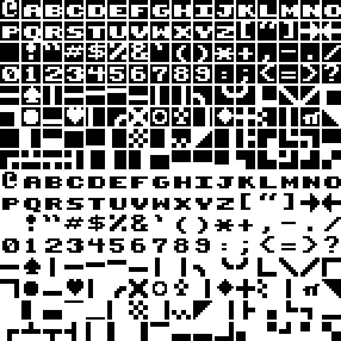

# mindmaster

The game of [Mastermind](https://en.wikipedia.org/wiki/Mastermind_(board_game)) for the Commodore 128


## Loading the Game

Copy the [disk image](mindmaster.d64) file to a floppy disk or open it with a Commodore 128 emulator, such as `x128` in [VICE](http://vice-emu.sourceforge.net/).

On the Commodore 128 (in 128 mode only), type the following. (Note that an emulator might do this for you automatically.)

```basic
LOAD "*",8
RUN
```

## Playing the Game

Mindmaster is a code-breaking game where you attempt to guess the correct combination and sequence of several colored "pegs" that have been randomly selected by the computer.

### Game Options


On the initial screen, you have four options:

- Press **N** for Normal mode (equivalent to original Mastermind)
- Press **E** for Expert mode (equivalent to Super Mastermind)
- Press **C** for Custom mode
- Press **Q** to Quit

If you've already played a game, pressing the **spacebar** will start a new game using the options you previously selected.

### Game Modes

If you select normal or expert modes, the game will immediately begin. If you select custom mode, you will be prompted to customize the following values:

- the number of guesses you have (rows)
- the number of pegs per row (columns)
- the possible number of peg colors

Here's a summary of the available game modes:

| Mode   | Rows | Columns | Colors |
|--------|------|---------|--------|
| Normal | 10   | 4       | 6      |
| Expert | 12   | 5       | 8      |
| Custom | 2-20 | 2-8     | 2-13   |

Note that colors may be repeated and no blanks are allowed in the solution.

### In-Game Controls


1. Move the flashing arrow up and down using the up and down cursor keys.
2. To select a colored peg, hit the spacebar.
3. Use the left cursor key to undo a selection.
4. Selecting the column's last peg will submit your guess.

### Feedback and Winning


Once you submit your guess, a set of zero or more feedback pegs may be displayed to the left of that row.

- Each dark grey peg indicates that one peg in your guess is the correct color and in the correct position.
- Each white peg indicates that one peg in your guess is the correct color, but in the wrong position.
- No feedback pegs are shown for a peg that is the wrong color, i.e. no pegs of that color are present in the solution.

You win if you guess the code before you run out of guesses.

## Compiling

Install development tools appropriate for your platform, including GNU Make.

You'll need to install VICE (for the `petcat`, `c1541`, and `x128` executables). On macOS using Homebrew:

```sh
brew install vice
```

To compile and automatically run using the `x128` emulator:

```shell
make
```

## Notes

I originally wrote this in 1991. The original version used a joystick in port 2 to play, but I recently updated the controls to use the cursor keys and spacebar to make it easier to play in an emulator.

The game uses a [custom character set](./mindmaster.chr) that I created, as well. (See below for example.)


